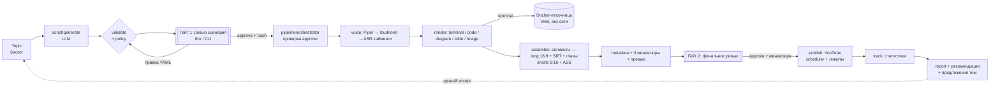

# Архитектура TechStudio

## Модули (`src/techstudio/`)

| модуль | роль |
|---|---|
| `schemas.py` | все контракты: Channel, Topic, Script/сцены, артефакты этапов, статусы, Publication, StatsSnapshot |
| `config.py` | Settings (env `TS_*`), YAML канала/тем/голосов |
| `core/` | ffmpeg-обёртка, probe, энкодеры, storage, манифесты, лог, SQLite, LLM/ASR-бэкенды, субтитры (аналоги ClipFactory, ADR 0001) |
| `script/` | генерация, валидация, YAML round-trip, fake-LLM |
| `sandbox/` | policy команд, Docker-раннер |
| `render/` | рендереры сцен и registry (`TS_RENDERERS`) |
| `voice/` | TTSProvider: Piper, Fake; словарь произношения |
| `timing.py` | длительность сцен, выравнивание слов, freeze/trim |
| `assemble/` | сегменты, длинное видео, шортсы, главы, музыка |
| `thumbnail/` | 3 варианта миниатюр |
| `pipeline/` | жизненный цикл сценария, этапы, orchestrator, ревью, публикация |
| `publish/` | YouTube API, fake, scheduler |
| `track/` | сбор статистики, отчёт |
| `topics/` | бэклог, предложения тем |
| `bot/` | логика гейтов + aiogram-адаптер |

## Инварианты
- Рендер только для одобренной версии (`approved.json` = версия + sha256), проверка в orchestrator.
- Команды — только через policy и только в песочнице; сеть — только с явным `network: true`.
- Публикация только после финального approve и выбора миниатюры; дневные лимиты в scheduler.
- Субтитры — исходный текст сценария; словарь произношения только для TTS.
